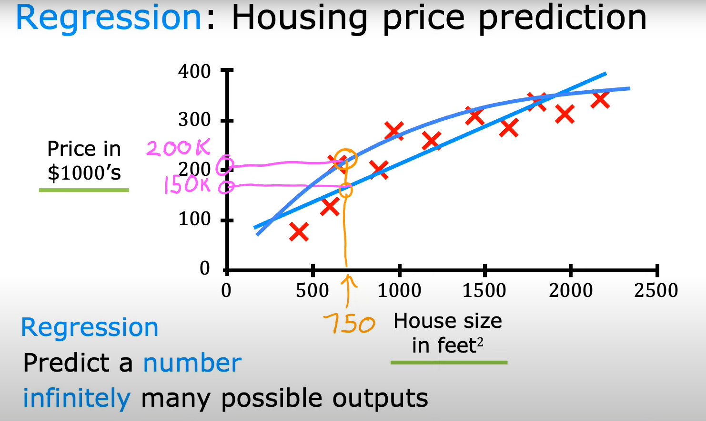

# **1. Machine Learning Algorithms**
    -Supervised learning

    -Unsupervised learning
    -Recommender systems
    -Reinforcement learning

Practical advice for applying learning algorithms.
These algorithms are the tools. Applying is knowing how to use these tools. Practical advice for applying is as important as knowing what those algorithms are and do.

## **Supervised Learning**

    Input, X --> Labeled Output, Y

Learns from being given "right answers".

|Input, X |Labeled Output, Y | Application|
|---------|------------------|------------|
|email    |spam? (0/1)       |spam filtering|
|radar image, info|position of other cars|self-driving car|
|ad, user info| click? (0/1)|online advertising|
|audio|text transcript|speech recognition|
|Turkish|German|machine translation|

One example of supervised learning algorithms is regression algorithm.

### **Regression**

