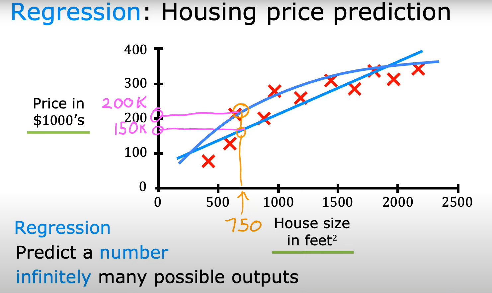
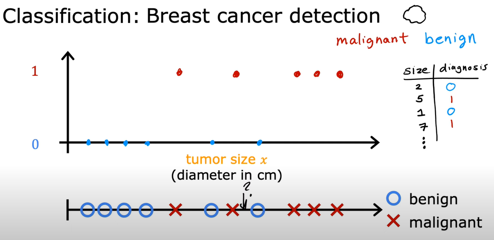
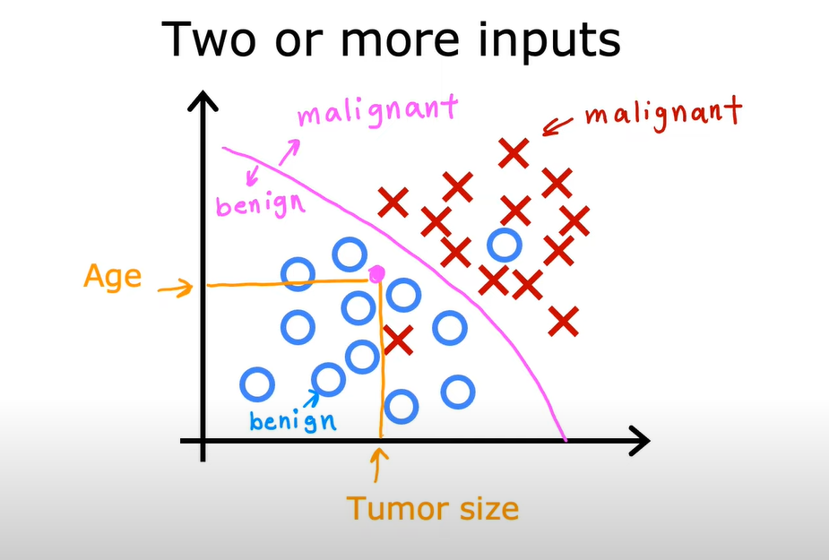

# **1. Machine Learning Algorithms**
    -Supervised learning

    -Unsupervised learning
    -Recommender systems
    -Reinforcement learning

Practical advice for applying learning algorithms.
These algorithms are the tools. Applying is knowing how to use these tools. Practical advice for applying is as important as knowing what those algorithms are and do.

## **Supervised Learning**

    Input, X --> Labeled Output, Y

Learns from being given "right answers".

|Input, X |Labeled Output, Y | Application|
|---------|------------------|------------|
|email    |spam? (0/1)       |spam filtering|
|radar image, info|position of other cars|self-driving car|
|ad, user info| click? (0/1)|online advertising|
|audio|text transcript|speech recognition|
|Turkish|German|machine translation|

One example of supervised learning algorithms is regression algorithm.

### **Regression**

If I have a data set including house prices for a given house size I can use the data set for guessing house price of a certain house size. 
In order to do that I can use a **straight line** or **curve based** on which one is better fit for the data.

For example if I want to determine the house price of 750 feet^2 house size. House price will be $150k or $200k, respectively, for the fittest straight line and a curve. 

### **Classification**

If I have a data set including types of tumor for a given size of tumor I can use the data set for guessing the tumor type of a tumor of certain size.

**Classification** predicts categories from small finite set of possible outputs whereas **Regression** predicts real numbers from infinite set of possible outputs.
Classification has **categorical** output type but regression has **continuous** output type.
Classes and categories are interchangeable within this context.

|size|diagnosis|
|----|---------|
|2|0|
|5|1|
|1|0|
|7|1|
|...|...|

**0**: benign tumor, **1**: malignant tumor

I can also use two or more input to predict **numbers** (regression) and **categories** (classification).

